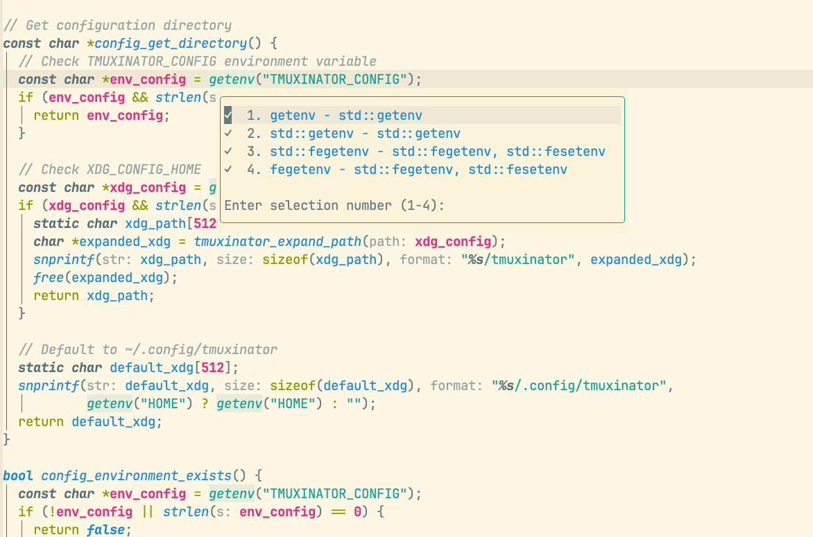
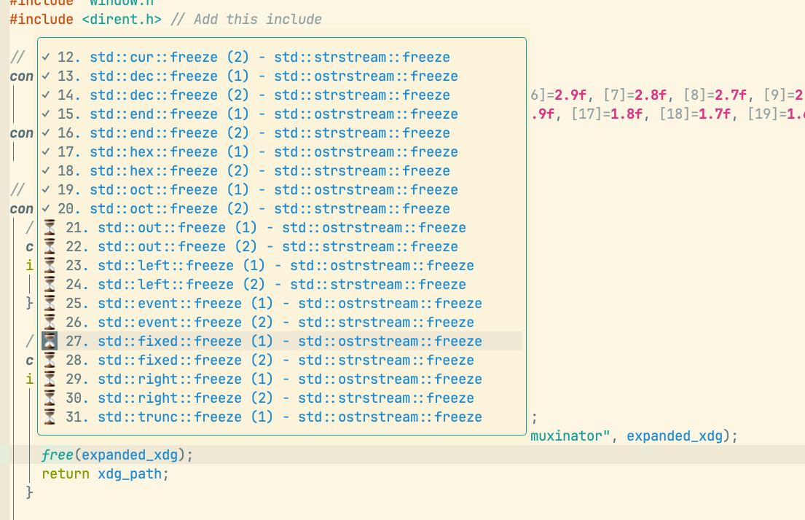
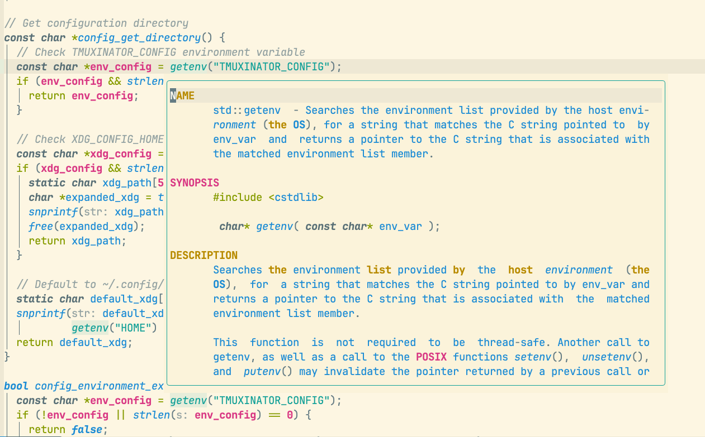
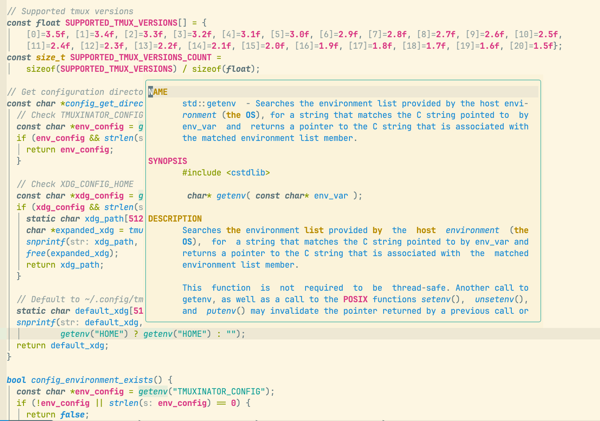
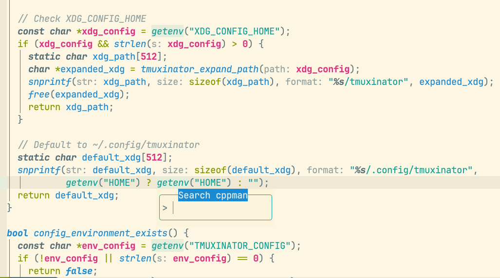

 # fast-cppman.nvim
A NeoVim plugin that provides a fast, asynchronous interface for viewing C/C++ documentation using **cppman** and **man** pages, with intelligent caching and navigation features.

 ## Features
- **Asynchronous Execution**: Non-blocking UI with configurable concurrent job limits
- **Intelligent Caching**: Automatic caching of results for faster subsequent lookups
- **Prefetching**: Pre-loads top N options when multiple matches are found
- **Navigation History**: Full back/forward navigation with unified history mode
- **Flexible Window Positioning**: Choose between cursor-relative or centered positioning
- **Adaptive Window Sizing**: Windows automatically resize based on content and screen space
- **Fallback Support**: Configurable fallback to `LSP hover` when documentation isn't available
- **Syntax Highlighting**: Proper syntax highlighting for documentation
- **Interactive Selection**: Visual selection interface for multiple matches
- **Search Input**: Popup input for manual searches
- **Word Navigation**: Follow links within documentation with simple keybindings
- **Multi-Adapter Support**: Supports both `man` and `cppman` with filetype-specific configurations
## Screenshots

### Multiple match selection


### Asynchronous cache multiple cppman pages


### Opened cppman manpage



### Popup search input


---

## Installation
 Install using your favorite package manager. For example,
##  with [LazyVim](https://www.lazyvim.org/configuration/lazy.nvim):
 ```lua
return {
  "mcc0001/fast-cppman.nvim",
  ft = { "c", "cpp" },
  opts = {
    max_prefetch_options = 20, -- Prefetch top N options when multiple matches found
    max_width = 200, -- Maximum width of documentation window
    max_height = 20, -- Maximum height of documentation window
    min_height = 5, -- Minimum height of documentation window
    input_width = 20, -- Width of input popup
    enable_async = true, -- Enable async operations
    max_async_jobs = 5, -- Maximum concurrent async jobs
    history_mode = "unified", -- Navigation history mode
    position = "cursor", -- "cursor" or "center" window placement
    auto_select_first_match = false, -- Auto-select first match in selections

    -- Adapter configurations
    adapters = {
      man = {
        cmd = "man",
        args = "-S3",
        env = { MANWIDTH = "COLUMNS" },
        error_patterns = { "No manual entry for" },
        exit_code_error = false,
        fallback_to_lsp = true,
        supports_selections = false,
      },
      cppman = {
        cmd = "cppman",
        args = "",
        env = { COLUMNS = "COLUMNS" },
        error_patterns = { "nothing appropriate" },
        exit_code_error = false,
        fallback_to_lsp = true,
        supports_selections = true,
      },
    },

    -- Filetype-specific adapter configurations
    filetype_adapters = {
      c = { adapter = "man" },
      cpp = { adapter = "cppman" },
      default = { adapter = "cppman" },
    },
  },
  keys = {
    {
      "<leader>cp",
      function()
        require("fast-cppman").open_docpage_for(vim.fn.expand("<cword>"))
      end,
      desc = "Search current function from cppman",
    },
    {
      "<leader>cP",
      function()
        require("fast-cppman").input()
      end,
      desc = "Open cppman search box",
    },
  },
}
 ```
## Configuration
 You can setup the plugin with the following code:
 ```lua
 require("fast-cppman").setup({
    max_prefetch_options = 20, -- Prefetch top N options when multiple matches found
    max_width = 200, -- Maximum width of documentation window
    max_height = 20, -- Maximum height of documentation window
    min_height = 5, -- Minimum height of documentation window
    input_width = 20, -- Width of input popup
    enable_async = true, -- Enable async operations
    max_async_jobs = 5, -- Maximum concurrent async jobs
    history_mode = "unified", -- Navigation history mode
    position = "cursor", -- "cursor" or "center" window placement
    auto_select_first_match = false, -- Auto-select first match in selections

    -- Adapter configurations
    adapters = {
      man = {
        cmd = "man",
        args = "-S3",
        env = { MANWIDTH = "COLUMNS" },
        error_patterns = { "No manual entry for" },
        exit_code_error = false,
        fallback_to_lsp = true,
        supports_selections = false,
      },
      cppman = {
        cmd = "cppman",
        args = "",
        env = { COLUMNS = "COLUMNS" },
        error_patterns = { "nothing appropriate" },
        exit_code_error = false,
        fallback_to_lsp = true,
        supports_selections = true,
      },
    },

    -- Filetype-specific adapter configurations
    filetype_adapters = {
      c = { adapter = "man" },
      cpp = { adapter = "cppman" },
      default = { adapter = "cppman" },
    },
  },
)
 ```

## Integration with LSP
You can configure the plugin to use the same keybinding for both fast-cppman and LSP hover documentation. When pressed, it will first try to show cppman documentation, and if that fails, it will fall back to LSP documentation.

#### Example Configuration
```lua
return {
  "neovim/nvim-lspconfig",
  opts = {
    servers = {
      clangd = {
        on_attach = function(client, bufnr)
          vim.keymap.set("n", "K", function()
            local word = vim.fn.expand("<cword>")
            if word ~= "" then
              vim.cmd("Fastcppman " .. word)
            else
              vim.notify("No word under cursor")
            end
          end, { buffer = bufnr, noremap = true, silent = true })
        end,
      },
    },
  },
}
```
This configuration sets up the K key to:

1. First try to find documentation using fast-cppman

2. If no cppman entry is found (and fallback_to_lsp_hover is enabled), automatically fall back to LSP hover documentation

3. If there's no word under cursor, show a notification

Make sure to enable the fallback option in your cppman configuration:

```lua
require('fast-cppman').setup({
  fallback_to_lsp_hover = true, -- Enable LSP fallback
  -- other options...
})
```
## Usage
The plugin provides the following commands:

`:Fastcppman [term]` - Open cppman for the given term, or prompt for a term if none provided.so call the functions directly:

You can also call the functions directly:
 ```lua
 local cppman = require("fast-cppman")
 -- Open the search input
 cppman.input()
 -- Open cppman for a specific term
 cppman.open_docpage_for("std::vector")
 ```
## Keymaps
 The user's example configuration sets up two keymaps:
 ```lua
 require("fast-cppman")
 vim.keymap.set("n", "<leader>cp", function()
   require("fast-cppman").open_docpage_for(vim.fn.expand("<cword>"))
 end)
 vim.keymap.set("n", "<leader>cP", function()
   require("fast-cppman").input()
 end)
 ```
## Keymaps
- The plugin provides these default keymaps in `fast-cppman` buffers:
- `K` or `<C-]>`: Follow the word under the cursor (open its documentation).
- `<C-o>`: Go back to the previous page.
- `<C-i>`: Go forward to the next page.
- `q` or `<ESC>`: Close the `fast-cppman` window.
- `j/k`, `gg/G`: Navigate lines in selection windows.

## Navigation
The plugin maintains navigation history between pages:
- Use `<C-o>` to go back to previous pages
- Use `<C-i>` to go forward again
- Use `<C-]>` to search the current cursor word in cppman buffer
## Navigation System
1. Unified Mode: History works across both selection and content windows
2. Manpage Mode: History only works within content windows
## Window Positioning
Two positioning modes are available:
1. `Cursor Relative`: Windows appear near the cursor, intelligently choosing above or below based on available space
2. `Center`: Windows are centered on the screen
Windows automatically resize based on content length and available screen space.
## Asynchronous Features
- Non-blocking UI: All cppman operations run asynchronously
- Prefetching: Top N options are pre-loaded when multiple matches are found
- Job Queueing: Manages concurrent jobs with configurable limits
- Intelligent Caching: Results are cached for instant subsequent access
## Requirements
- Requires the cppman CLI tool installed and available in your PATH.
- cppman CLI tool installed and in PATH
- Optional: LSP setup for fallback functionality
## Example Workflow
1. Press `<leader>cP` to open the input popup.
2. Type `std::vector` and press <Enter>.
3. If multiple matches exist, select the correct entry.
4. Navigate using `K` or `<C-]>`.
5. Use `<C-o>` and `<C-i>` to navigate backward/forward between visited pages.
6. Press `q` or `<ESC>` to close the window.
